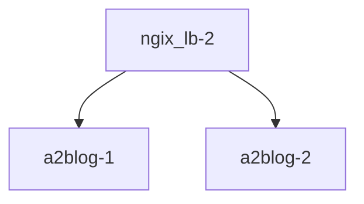

## CODE : https://github.com/dMario24/dcompose

## 서비스 디스커버리 NGINX 버전 nginx -> ( httpd, httpd )

# Dockerfile



```
# ./gradlew bootJar
$ sudo docker build -t a2blog:1.1.0 docker_file/httpd/

# java -jar app.jar <오션 - 포트, 기타 등등> 
$ sudo docker run -dit --name myblog-1 -p 8051:80 a2blog:251014.1
$ sudo docker build -t nginx_lb:251014.1 docker_file/nginx/

# 아래와 같이 하면 안됨 lb 에서 myblog-1 을 찾지 못함 ( docker logs 명령을 통해 확인 )
# $ sudo docker run --name ngix_lb-1 -d -p 9051:80 nginx_lb:251014.1

# https://docs.docker.com/engine/reference/commandline/run/#options
$ sudo docker run --name ngix_lb-1 -d -p 9052:80 --link myblog-1 nginx_lb:251014.1
```

- [ ] myblog-2 추가
```bash
# 
# 1. 서비스를 추가
$ sudo docker run -dit --name myblog-2 -p 8052:80 a2blog:251014.1 

# 2. vi docker_file/nginx/default.conf 수정

# 3. 수정된 위 파일 반영을 위해 다시 빌드 ( 버전 변경 )
$ sudo docker build -t nginx_lb:251014.2 docker_file/nginx/

# 4. 기존 LB 중단 및 삭제 - 지금 부터 서비스 중단 - 실 서비스라면 서비스 중단 시간 공지 필요
$ sudo docker stop ngix_lb-1;sudo docker rm ngix_lb-1

# 5. 새로운 myblog-2 가 추가된 LB 컨테이너 가동 - 지금 부터 다시 서비스 정상
$ sudo docker run --name ngix_lb-1 -d -p 9052:80 --link myblog-1 --link myblog-2 nginx_lb:251014.2
```

- [ ] blog-1 blog-2 가 잘 추가 되고 연결 되는지 확인
- http://localhost:9501 로 접속 하면서 ....
```bash
$ sudo docker logs -f myblog-1
```

```bash
$ sudo docker logs -f myblog-2
```

- 아 불편하다
- 컨테이더를 삭제, 다시 생성해야 한다
- link 옵션을 쓰면 컨테이너 간 통신을 일시적으로 연결할 수 있지만, 이미 deprecated(더 이상 권장되지 않음)된 기능
- 대신 Docker network를 쓰면, 훨씬 안전하고 유연하게 여러 컨테이너를 연결 가능

```bash
# 네트워크 생성
$ sudo docker network create blog-net
$ sudo docker network ls
$ sudo docker network --help

# 기존 컨테이너 삭제(docker stop <ID>;docker rm <ID>) 및 아래와 같이 다시 생성
$ sudo docker run -dit --name myblog-1 -p 8051:80 a2blog:251014.1
$ sudo docker run -dit --name myblog-2 -p 8052:80 a2blog:251014.1

# 네트워크 안에 blog-1 추가
$ sudo docker network connect blog-net myblog-1

# 네트워크 안에 blog-2 추가
$ sudo docker network connect blog-net myblog-2


# 네트워크 안에 LB 추가

```

# docker compose

```bash
# https://docs.docker.com/compose/reference/
$ sudo docker compose -f compose/auto_lb/compose.yml

$ docker compose -f docker_file/docker-compose.yml ls
NAME                STATUS              CONFIG FILES
dmario24_lb         running(3)          /home/tom/code/k9s/docker_file/docker-compose.yml

$ docker compose -f docker_file/docker-compose.yml stop

$ docker compose -f docker_file/docker-compose.yml start

$ docker compose -f docker_file/docker-compose.yml down

$ docker compose -f docker_file/docker-compose.yml images
```

# scale in/out

- [ ] https://docs.docker.com/compose/compose-file/deploy/#replicas
- [ ] https://docs.docker.com/engine/reference/commandline/compose_up/#options


```bash
$ docker compose up -d --scale blog=5
```

# compose command

#### up

- [x] docker compose up --help
- [ ] https://docs.docker.com/engine/reference/commandline/compose_up/

```
-d: (docker run -d 옵션 처럼) 서비스 실행이 데몬으로 실행됨
--build: 서비스 (다시)시작 하고 이미지를 새로 만듬(Dockerfile 이 변경되는 경우 사용)
--force-recreate: 컨테이너를 지우고 새로 만듬
```

#### ps

- 현재 환경에서 실행 중인 각 서비스의 상태를 보여줍니다.

#### stop, start

- 서비스를 멈추거나, 멈춰 있는 서비스를 시작합니다.

#### down

- 서비스를 지웁니다. 컨테이너와 네트워크를 삭제하며, 옵션(--volume)에 따라 볼륨도 지웁니다.

#### logs

- 서비스의 로그를 확인할 수 있습니다. logs 뒤에 서비스 이름을 적지 않으면 도커 컴포즈가 관리하는 모든 서비스의 로그를 함께 보여줍니다.


# Use famous Jwilder nginx proxy
### scale out/in -> auto lb
- https://stackoverflow.com/questions/50203408/docker-compose-scale-x-nginx-conf-configuration
- https://github.com/nginx-proxy/nginx-proxy
- chrome 브라우저에서 http://aws.google.com:9889 확인 위해 window hosts 파일 수정필요


``` bash
$ docker compose -f compose/auto_lb/compose.yml  up -d --build --force-recreate

$ docker compose -f compose/auto_lb/compose.yml ls                             
NAME                STATUS              CONFIG FILES
awsgoo              running(2)          /home/tom/code/k9s/compose/auto_lb/compose.yml

$ docker compose -f compose/auto_lb/compose.yml  up -d --scale blog=5

docker compose -f compose/auto_lb/compose.yml ps
NAME                   IMAGE                    COMMAND                  SERVICE             CREATED              STATUS              PORTS
awsgoo-blog-1          awsgoo-blog              "/bin/sh -c 'service…"   blog                About a minute ago   Up About a minute   80/tcp
awsgoo-blog-2          awsgoo-blog              "/bin/sh -c 'service…"   blog                19 seconds ago       Up 17 seconds       80/tcp
awsgoo-blog-3          awsgoo-blog              "/bin/sh -c 'service…"   blog                19 seconds ago       Up 16 seconds       80/tcp
awsgoo-blog-4          awsgoo-blog              "/bin/sh -c 'service…"   blog                19 seconds ago       Up 17 seconds       80/tcp
awsgoo-blog-5          awsgoo-blog              "/bin/sh -c 'service…"   blog                19 seconds ago       Up 16 seconds       80/tcp
awsgoo-nginx-proxy-1   nginxproxy/nginx-proxy   "/app/docker-entrypo…"   nginx-proxy         About a minute ago   Up About a minute   0.0.0.0:9889->80/tcp
```
